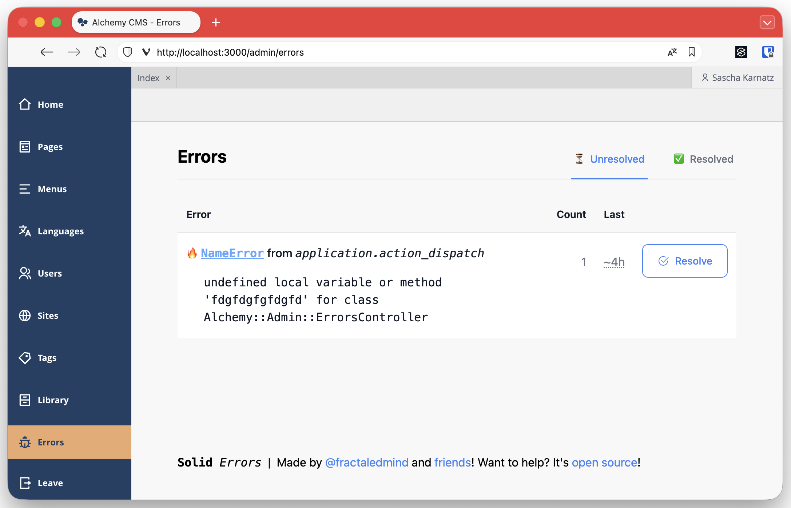

# Alchemy Solid Errors

A simple integration of Solid Errors into AlchemyCMS. It adds a new menu item into the Alchemy Admin
interface and integrates the Solid Errors Backend via iframe into the Alchemy Backend. Solid Errors Backend
is only available for admin users.



## Installation

Add the gem to your Gemfile and restart the application.

```shell
$ bundle add alchemy-solid_errors
```

Follow the installation instructions of [Solid Errors](https://github.com/fractaledmind/solid_errors?tab=readme-ov-file#installation). 
You have to run the Solid Errors generator:

```shell
$ rails generate solid_errors:install
```

> [!NOTE]
> This will necessary configuration for production. The gem will only show the menu item if Solid Errors is enabled in the environment.
> If you want to use this gem in development, you have to add the configuration manually to your `config/environments/development.rb`.

## Release a new version

First, bump the version with [gem-release](https://bundler.io/guides/creating_gem.html#releasing-the-gem):

```shell
gem bump --version minor
```

Second, generate the changelog entries. Set the version parameter with the upcoming version number.

```shell
rake changelog
```

Amend that changelog into the previous commit. After that go to [Releases Page](https://github.com/sitediver/alchemy-solid_errors/releases)
and create a new release. Be aware the tag has to start with `v` (e.g `v0.2.0`). Otherwise, the Release action will fail.
